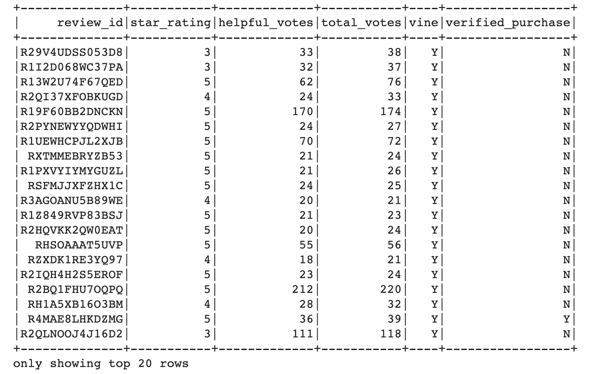
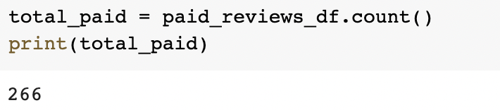
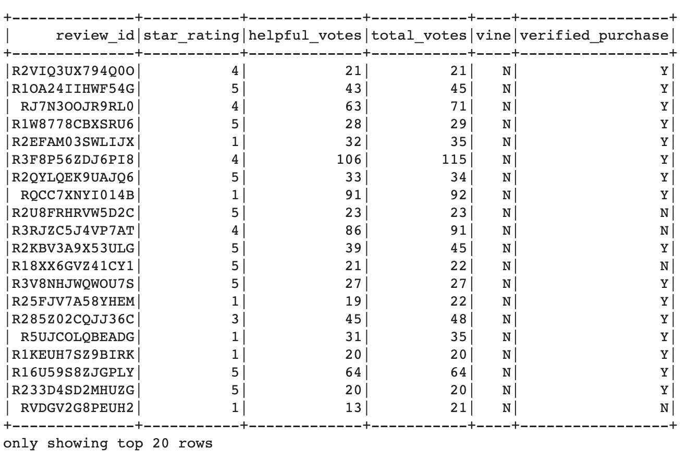
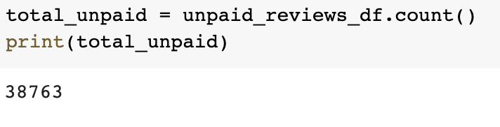

# __Amazon Vine Analysis__

## __Overview__:
The purpose of this analysis is to study Amazon's Vine reviews for a certain category of products, and check to see if there is any positivity bias in these reviews as opposed to non-Vine reviews.   

## __Results__:

For this analysis we have chosen Home Improvment product reviews from Amazon, and have used PySpark to analyze the data. The following are the results of this analysis:

- In the Home Improvement category there are 266 Vine reviews and 38763 non Vine reviews, as can be seen from the images below.

### Vine Reviews:

### Non Vine Reviews:

- There are 125 five star reviews in the Vine Category and 18242 five star reviews in the non Vine category.

- There are 46.992 percent of five star Vine reviews to Total Vine Reviews and 47.06 percent of five star non Vine reviews to total non Vine reviews.

## __Summary__:

From the numbers in the Home Improvement category of products, there does not seem to be a positivity bias for reviews in the Vine program. 

The results indicate that the percentage of five star Vine reviews to total Vine reviews is 46.99%. The percentage of five star Non Vine reviews to Total Non Vine, is also nearly the same at 47.06%. Therefore being part of the Vine program or not does not seem to have an impact on 5 star reviews.

Therefore it can be concluded that the Vine program does not cause a positivity bias through its reviews.

Additional analysis that can be done with this dataset are:

- Percentage calculation for other star ratings both in the Vine and non Vine categories. This way we can get the percentage distribution for each star rating and we can check if the percentage is comparable between the two categories. A rating of 4 stars can also contribute towards positivity bias.

- Positivity ratings across products -  Positivity bias can also be studied across different products to see if the vine program offers a higher positive rating for certain products over others.